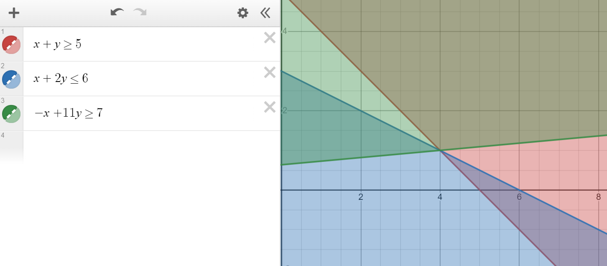
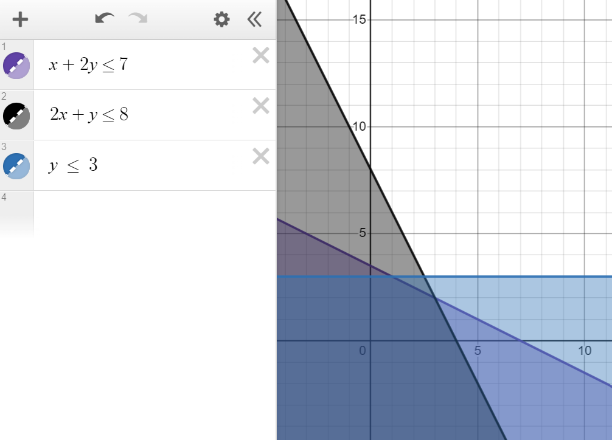
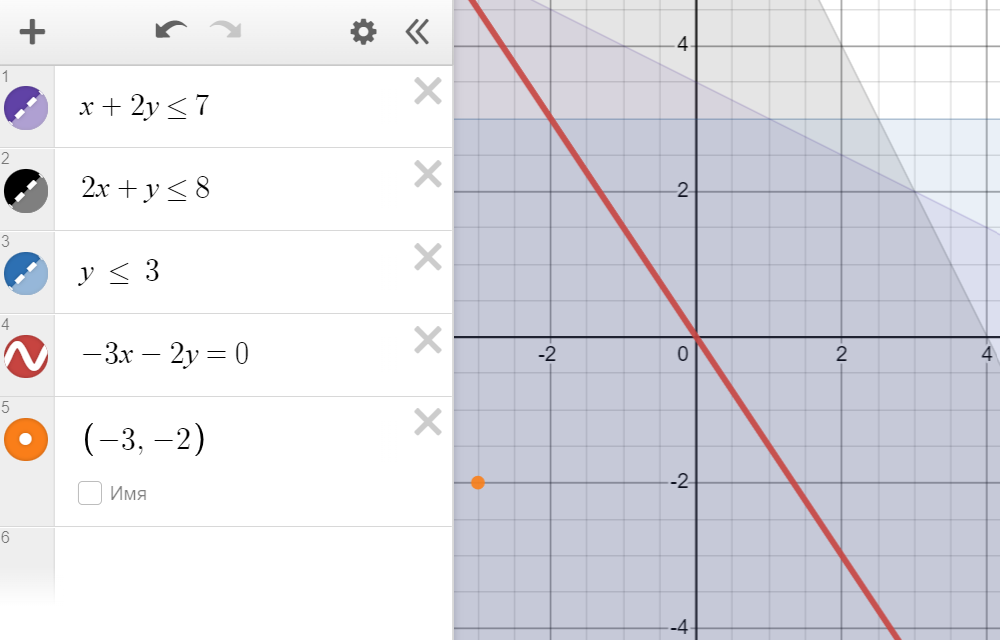
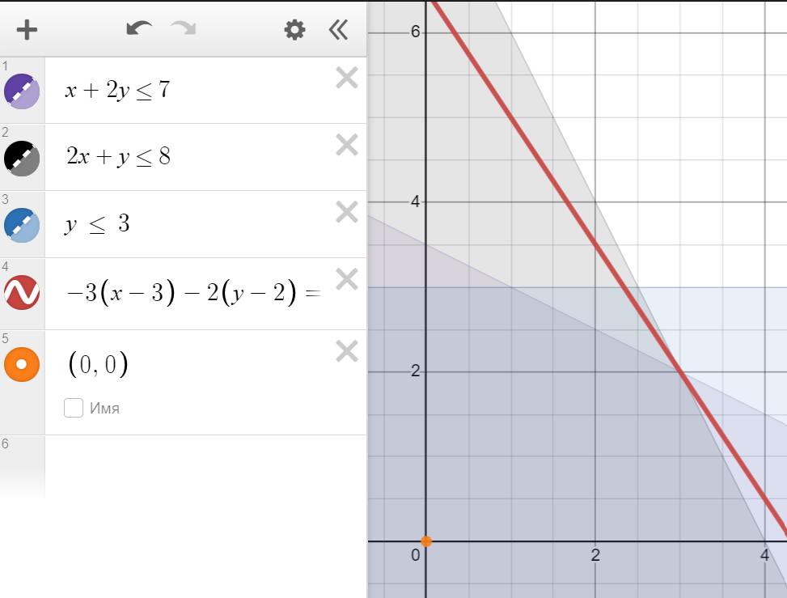
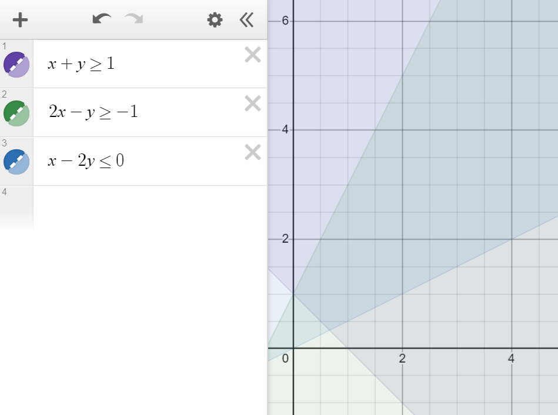
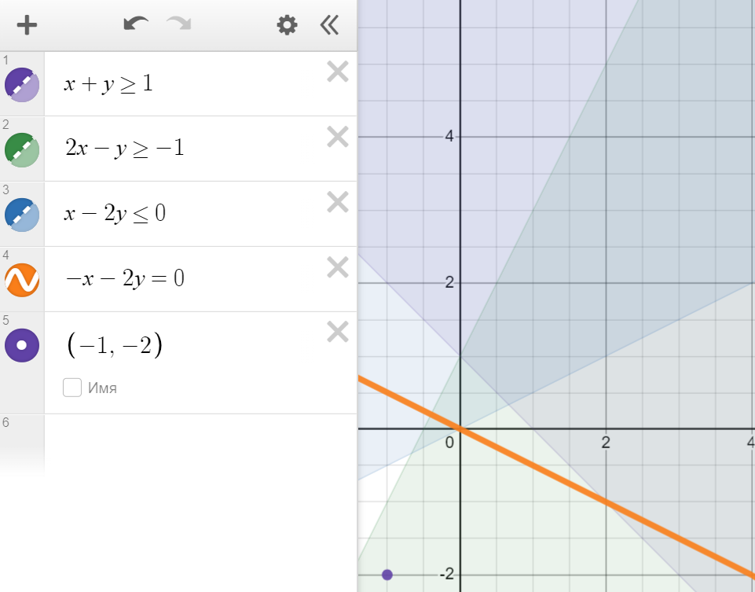
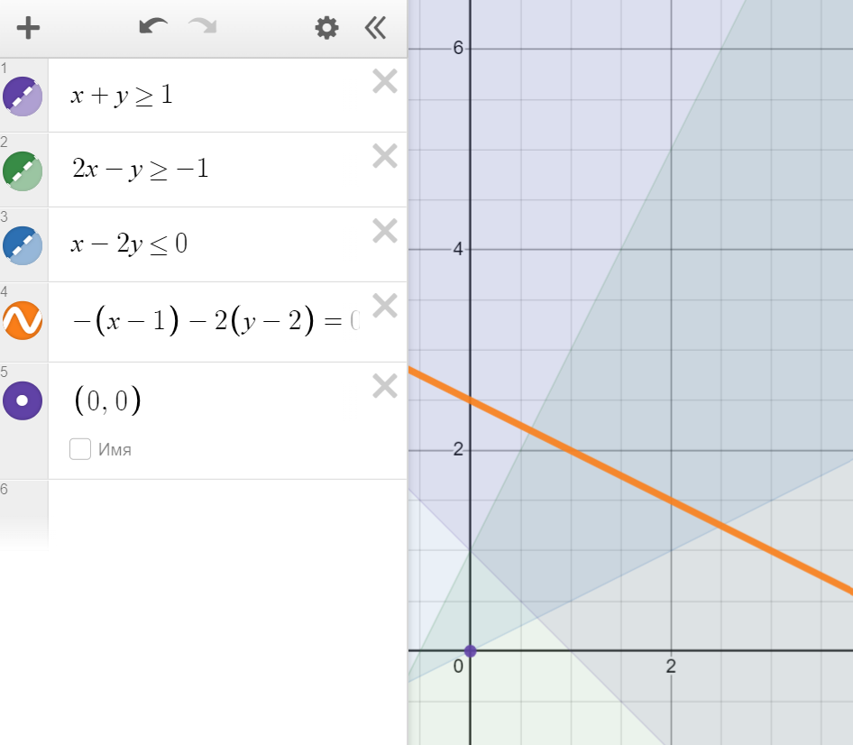

# Лабораторная работа №1 "Симплекс-метод"

> Работу выполнили: Шевченко Валерий, Иванов Александр M33001

## **Постановка задачи**

Задача линейного программирования - задача, которая имеет вид:

$$
c_1x_1 + c_2x_2 + \dots + c_nx_n \rightarrow \max(\min) \\
\begin{cases}
a_{i1}x_1 + a_{i2}x_2 + \dots + a_{in}x_n \leq b_i, i = 1, \dots, m \\
a_{i1}x_1 + a_{i2}x_2 + \dots + a_{in}x_n = b_i, i = m + 1, \dots, m + p \\
x_i \geq 0, i = 1, \dots, n \\
\end{cases}
$$

где $c_i$ - коэффициенты целевой функции, $a_{ij}$ - коэффициенты ограничений, $b_i$ - правые части ограничений, $x_i$ - переменные

## Описание симплекс метода

Алгоритм симплекс метода состоит из нескольких шаков

1. Построение опорного плана
   1. Выбор базиса
   2. Построение базисного решения
2. Построение оптимального плана
   1. Поиск переменной для вхождения в базис (ведущего столбца)
   2. Поиск переменной для вымещения из базиса (ведущей строки)
   3. Вычисление базисного решения, при его неоптимальности повторяем процесс

## **Решение задач из примеров**

### **Пример 1**

$$
f(x) = -6x_1 - x_2 - 4x_3 + 5x_4 \to \min \\
\begin{cases}
3x_1 + x_2 - x_3 + x_4 = 4 \\
5x_1 + x_2 +x_3 - x_4 = 4 \\
x_j \geq 0, j=1,2,3,4
\end{cases}
$$

Ответ: 
$x_1 = 0, x_2=4, x_3=0, x_4 = 0, f(x)=-4$

## **Пример 2**

$$
f(x)=-x_1-2x_2-3x_3+x_4 \to \min \\
\begin{cases}
x_1-3x_2-x_3-2x_4=-4 \\
x_1-x_2+x_3 = 0 \\
x_j \geq 0, j=1,2,3,4
\end{cases}
$$

Ответ:
$x_1=2, x_2=2, x_3=0, x_4=0, f(x)=-6$

## **Пример 3**

$$
f(x)=-x_1-2x_2-3x_3+x_4 \to \min\\
\begin{cases}
x_1-3x_2-x_3-2x_4=-4\\
x_1+x_2+x_3+3x_4+2x_5=9\\
x_2+x_3+2x_4+x_5=6 \\
x_j\geq 0, j=1,2,3,4,5
\end{cases}
$$

Ответ:
$x_1=3, x_2=2, x_3=4, x_4=0, x_5=0, f(x) = -11$
## **Пример 4**

$$
f(x)=-x_1-2x_2-x_3+3x_4-x_5 \to min \\
\begin{cases}
x_1+x_2+2x_4+x_5=5 \\
x_1+x_2+x_3+3x_4+2x_5 = 9 \\
x_2+x_3+2x_4+x_5=6 \\
x_j \geq 0, j=1,2,3,4,5
\end{cases}
$$

Ответ:
$x_1=4, x_2=0, x_3=0,x_4=1, x_5=7, f(x)=-10$

## **Пример 5**

$$
f(x)=-x_1+4x_2-3x_3+10x_4 \to \min \\
\begin{cases}
x_1+x_2-x_3-10x_4=0\\
x_1+14x_2+10x_3-10x_4=11\\
x_j \geq 0, j=1,2,3,4
\end{cases}
$$

Ответ:

$x_1=1, x_2=0, x_3=1, x_4 =0, f(x)=-4$

## **Пример 6**

$$
f(x)=-x_1+5x_2+x_3-x_4 \to \min \\

\begin{cases}
x_1+3x_2+3x_3+x_4 \leq 3 \\
2_x1+3x_3-x_4 \leq 4 \\
x_j  \geq 0, j=1,2,3,4
\end{cases}
$$

Ответ:
$x_1=2\frac{1}{3}, x_2=0,x_3=0,x_4=\frac{2}{3},x_5=0,x_6=0,f(x)=-3$

## **Пример 7**

$$
f(x)=-x_1-x_2+x_3-x_4+2x_5 \to \min \\
\begin{cases}
3x_1+x_2+x_3+x_4-2x_5=10 \\
6x_1+x_2+2x_3+3x_4-4x_5=20 \\
10x_1+x_2+3x_3+6x_4-7x_5=30 \\
x_j\geq 0, j=1,2,3,4,5
\end{cases}
$$

Ответ:
$x_1=0,x_2=0,x_3=10,x_4=0,x_5=0,f(x)=10$

## **Ответы на вопросы**

### **1. Общая и каноническая форма задачи линейного программирования.**

Задача линейного программирования в произвольной (общей) форме - задача, в которой требуется минимизировать или максимизировать линейную форму при заданных ограничениях (как равенствах, так и неравенствах).

Задача ЛП в канонической форме - задача вида:

$$ \begin{cases}
c^T \cdot \overline x \rightarrow min (max) \\
A \cdot \overline x = \overline b \\
\overline x \ge \overline 0
\end{cases}
$$

### **2. Двойственная задача ЛП.**

Двойственная задача ЛП - задача, которая получается их исходной задачи ЛП следующим образом:

* Каждая переменная из исходной задачи становится ограничением в двойственной задачи.
* Каждое ограничение из исходной задачи становится переменной в двойственной задачи.
* Направление решенея задачи изменяется, максимум на минимум и наоборот.

$$ 
    \begin{cases}
        \overline c^T \cdot \overline x \rightarrow min (max) \\
        A \cdot \overline x = \overline b \\
        \overline x \ge \overline 0
    \end{cases}
    \quad \rightarrow \qquad
    \begin{cases}
        \overline b^T \cdot \overline y \rightarrow max (min) \\
        A^T \cdot \overline y = \overline c \\
        \overline y \ge \overline 0
    \end{cases}
$$ 

### **3. Метод искусственного базиса.**

Метод искусственного базиса используется для нахождения базисного решения задачи ЛП. В ограничения и в функцию вводят "искусственные" переменные следующим образом:

$$
    \begin{cases}
        \overline c^T \cdot \overline x - m \cdot \overline r \rightarrow min (max) \\
        A \cdot \overline x + \overline r = \overline b \\
        \overline x \ge \overline 0
    \end{cases}
$$

Для данной системы строится симплекс таблица и делаются такие же преобразования, как и в при обычном решением симплекс методом. Цель - свести переменные r к 0, когда это произойдёт их можно будет исключить из таблицы и продолжить решение уже без "искусственных" переменных.

### **4. Доказать, что ОДР является выпуклым множеством.**

Предположим, что в области есть хотя бы две угловые точки, возьмём любые две. Пусть это $\overline x_1$ и $\overline x_2$, они же - два допустимых решения, они же - два вектора. Пусть ограничения задачи в матричной форме: $A \cdot \overline x_1 = \overline b$ и $A \cdot \overline x_2 = \overline b$.

Пусть $\overline x_3 = \alpha \overline x_1 + (1 - \alpha) \overline x_2$ - произвольная линейная комбинация векторов $\overline x_1$ и $\overline x_2$.

Покажем, что $\overline x_3$ - тоже допустимое решение.

$$
    A \cdot \overline x_3 = A \cdot (\alpha \overline x_1 + (1 - \alpha) \overline x_2) \\
    A \cdot \overline x_3 = \alpha A \cdot \overline x_1 + A \cdot (1 - \alpha) \overline x_2 \\
    A \cdot \overline x_3 = \alpha \overline b + \overline b - \alpha \overline b = \overline b
$$

Так как результат линейной комбинации двух любых положительных компонент $\overline x_1$ и $\overline x_2$ и каких-то неотрицательных коэфициентов $\alpha$ и $1 - \alpha$ является допустимым решением, то множество допустимых решений - выпуклое.

### **5. Может ли ОДР в задаче ЛП состоять из одной единственной точки? Если да, то привести пример.**

Если результатом пересечения ограничений будет одна точка, то множество ОДР будет состоять из одной точки.

Пример:

$$
    \begin{cases}
        x_1 + x_2 >= 5 \\
        x_1 + 2x_2 <= 6 \\
        -x_1 + 11x_2 >= 7
    \end{cases}
$$

### **6. В чём заключается графический метод решения задачи ЛП?**

В случае если в задаче размерность $\overline x$ равна двум, на плоскости строится область допустимых решений. Потом строится прямая, отвечающая значению функции F равно нулю и вектор-градиент, составленный из коэффициентов целевой функции. Будем параллельно двигать прямую до первого или последнего касания ОДР (в случае с минимизацией последнее, в случае максимизации - последнее). Угловая точка, в которой будет пересечение - минимальное/максимальное решение.

### **7. Используя графический метод, найти решение задачи линейного программирования:**

$$
    f(x) = -3x_1-2x_2 \rightarrow min, \\
    \begin{cases}
        x_1 + 2x_2 \le 7 \\
        2x_1 + x_2 \le 8 \\
        x_2 \le 3 \\
        x_i \ge 0, i = 1, 2
    \end{cases}
$$

Построим ОДР.

Построим прямую и вектор-градиент (на рисунке обозначен точкой).

Параллельно переносим прямую до касания ОДР.

Прямая касается ОДР в угловой точке $(3, 2)$. Найдём минимальное значение функции $f(x) = -3 \cdot 3 - 2 \cdot 2 = -13$

**Ответ: $\overline x = (3, 2), f(x)_{min} = -13$**

### **8. Используя графический метод, найти решение задачи линейного программирования:**

$$
    f(x) = -x_1 - 2x_2 \rightarrow min, \\
    \begin{cases}
        x_1 + x_2 \ge 1 \\
        2x_1 - x_2 \ge -1 \\
        x_1 - 2x_2 \le 0 \\
        x_i \ge 0, i = 1, 2
    \end{cases}
$$

Построем ОДР.

Построим прямую и вектор-градиент (на рисунке обозначен точкой).

Параллельно переносим прямую до касания ОДР.

Как мы можем заметить, прямую можно переносить бесконечное количество раз, а угловая точка так и не будет встречена, то есть значение функции будет дальше уменьшаться, значит минимального значения функции нет.

**Ответ: Нет минимального значения, ОДР неограничена.**

### **9. Решить задачу симплекс-методом, используя $x_0$ в качестве начальной точки.**

$$
    f(x) = -5x_1 + 4x_2 - x_3 - 3x_4 - 5x_5 \Rightarrow min \\
    \begin{cases}
        3x_1 - x_2 + 2x_4 + x_5 = 5 \quad (1) \\
        2x_1 - 3x_2 + x_3 + 2x_4 + x_5 = 6 \quad (2) \\
        3x_1 - x_2 + x_3 + 3x_4 + 2x_5 = 9 \quad (3) \\
        x_j \ge 0, j = 1, 2, 3, 4, 5
    \end{cases} \\
    \overline x = (0, 0, 1, 2, 1)
$$

Выбираем $x_3$, $x_4$ и $x_5$, как базисные переменные. 

Вычтем из уравнения $(2)$ уравнение $(1)$, переменные $x_4$ и $x_5$ сократятся.

$$
    -x_1 - 2x_2 + x_3 = 1 \quad (4)
$$

Выразим $x_3$ из уравнения $(4)$ и подставим в уравнения $(2)$ и $(3)$.

$$
    3x_1 - x_2 + 2x_4 + x_5 = 5 \quad (5) \\
    4x_1 + x_2 + 3x_4 + 2x_5 = 8 \quad (6)
$$

Домножим уравнение $(5)$ на $2$ и вычтем из него уравнение $(6)$. 

$$
    2x_1 - x_2 + x_4 = 2 \quad (7)
$$

Выразим из уравнения $(7)$ $x_4$ и подставим в уравнение $(6)$.

$$
    -x_1 + 2x_2 + x_5 = 1 \quad (8)
$$

В итоге получаем систему ограничений.

$$
    \begin{cases}
        -x_1 - 2x_2 + x_3 = 1 \\
        2x_1 - x_2 + x_4 = 2 \\
        -x_1 + 2x_2 + x_5 = 1 \\
        x_j \ge 0, j = 1, 2, 3, 4, 5
    \end{cases} 
$$

Построем симплекс-таблицу.

| $базис$ | $x_1$ | $x_2$ | $x_3$ | $x_4$ | $x_5$ | $b$ |
| --- | --- | --- | --- | --- | --- | --- |
| $F$ | $-5$ | $4$ | $-1$ | $-3$ | $-5$ | 0 |
| $x_3$ | $-1$ | $-2$ | $1$ | $0$ | $0$ | $1$ |
| $x_4$ | $2$ | $-1$ | $0$ | $1$ | $0$ | $2$ |
| $x_5$ | $-1$ | $2$ | $0$ | $0$ | $1$ | $1$ |
| $\Delta$ | $5$ | $-9$ | $0$ | $0$ | $0$ | $-12$ |

План не оптимален, так как $\Delta_1$ положительна. Возьмём первый столбец, как разрешающий. Определим разрешающую строку. Отношения коэффициентов $b$ к коэффициентам $x_5$: $(\infty, 1, \infty)$. Таким образом, разрешающая строка - вторая. 

Делим вторую строку на $2$ и из первой и третьей строк вычитаем вторую строку домноженную на соответствуюбщий коэффициент из разрешающего столбца.

| $базис$ | $x_1$ | $x_2$ | $x_3$ | $x_4$ | $x_5$ | $b$ |
| --- | --- | --- | --- | --- | --- | --- |
| $F$ | $-5$ | $4$ | $-1$ | $-3$ | $-5$ | 0 |
| $x_3$ | $0$ | $-2.5$ | $1$ | $0.5$ | $0$ | $2$ |
| $x_1$ | $1$ | $-0.5$ | $0$ | $0.5$ | $0$ | $1$ |
| $x_5$ | $0$ | $1.5$ | $0$ | $0.5$ | $1$ | $2$ |
| $\Delta$ | $0$ | $-6.5$ | $0$ | $-2.5$ | $0$ | $-17$ |

План оптимален, так как все $\Delta_i$ отрицательны.

**Ответ: $\overline x = (1, 0, 2, 0, 2), f(x)_{min} = -17$**

### **10. Найти наибольшее значение функции**

$$
    f(x) = -x_1 + 3x_2 \rightarrow max, \\
    \begin{cases}
        x_1 + 2x_2 \le 4 \\
        x_1 - x_2 \ge 1 \\
        x_1 + x_2 \le 8 \\
        x_i \ge 0, i = 1, 2
    \end{cases}
$$

Приведём задачу к канонической форме, добавлением дополнительных переменных.

$$
    f(x) = -x_1 + 3x_2 \rightarrow max, \\
    \begin{cases}
        x_1 + 2x_2 + x_3 = 4 \\
        -x_1 + x_2 + x_4 = -1 \\
        x_1 + x_2 + x_5 = 8 \\
        x_i \ge 0, i = 1, 2, 3, 4, 5
    \end{cases}
$$

Выбираем $x_3$, $x_4$ и $x_5$ в качестве базисных переменных и построим симплекс-таблицу.

| $базис$ | $x_1$ | $x_2$ | $x_3$ | $x_4$ | $x_5$ | $b$ |
| --- | --- | --- | --- | --- | --- | --- |
| $F$ | $-1$ | $3$ | $0$ | $0$ | $0$ | 0 |
| $x_3$ | $1$ | $2$ | $1$ | $0$ | $0$ | $4$ |
| $x_4$ | $-1$ | $1$ | $0$ | $1$ | $0$ | $-1$ |
| $x_5$ | $1$ | $1$ | $0$ | $0$ | $1$ | $8$ |
| $\Delta$ | $1$ | $-3$ | $0$ | $0$ | $0$ | $0$ |

В столбце свободных переменных есть отрицательный коэффициент $-1$ во второй строке, это будет разрешающая строка. Разрешающим столбцом будет столбец, в котором находится наименьший коэффициент в строке. Это будет первый столбец.

Делим вторую строку на $-1$ и из первой и второй строк вычитаем второю строку домноженную на соответствующий коэффициент из разрешающего столбца.

| $базис$ | $x_1$ | $x_2$ | $x_3$ | $x_4$ | $x_5$ | $b$ |
| --- | --- | --- | --- | --- | --- | --- |
| $F$ | $-1$ | $3$ | $0$ | $0$ | $0$ | 0 |
| $x_3$ | $0$ | $3$ | $1$ | $1$ | $0$ | $3$ |
| $x_1$ | $1$ | $-1$ | $0$ | $-1$ | $0$ | $1$ |
| $x_5$ | $0$ | $2$ | $0$ | $1$ | $1$ | $7$ |
| $\Delta$ | $0$ | $-2$ | $0$ | $1$ | $0$ | $-1$ |

План не оптимален, так как $\Delta_2$ отрицательная, берём второй столбец, как разрешающий и найдём разрешающую строку. Отношения коэффициентов $b$ к коэффициентам $x_2$: $(1, \infty, 3.5)$. Следовательно разрешающая строка - первая.

Делим первую строку на $3$ и из второй и третьей строк вычитаем первую строку домноженную на соответствуюбщий коэффициент из разрешающего столбца.

| $базис$ | $x_1$ | $x_2$ | $x_3$ | $x_4$ | $x_5$ | $b$ |
| --- | --- | --- | --- | --- | --- | --- |
| $F$ | $-1$ | $3$ | $0$ | $0$ | $0$ | 0 |
| $x_2$ | $0$ | $1$ | $0.33$ | $0.33$ | $0$ | $1$ |
| $x_1$ | $1$ | $0$ | $0.33$ | $-0.66$ | $0$ | $2$ |
| $x_5$ | $0$ | $0$ | $-0.66$ | $0.33$ | $1$ | $5$ |
| $\Delta$ | $0$ | $0$ | $0.66$ | $1.66$ | $0$ | $1$ |

План оптимален, так как все $\Delta_i$ положительны. Можно отбросить добавочные переменные.

**Ответ: $\overline x = (2, 1), f(x)_{min} = -1$**