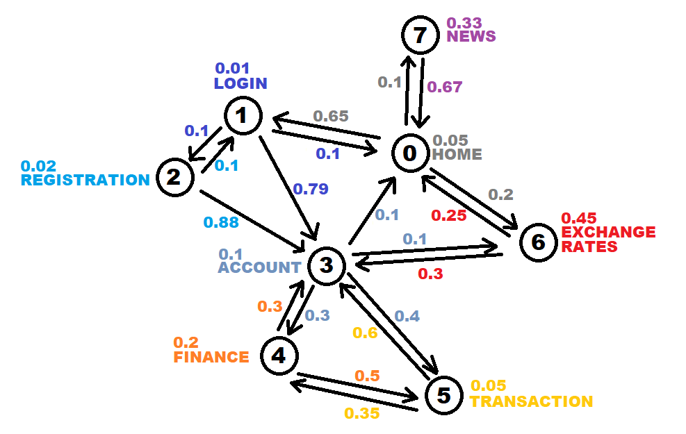
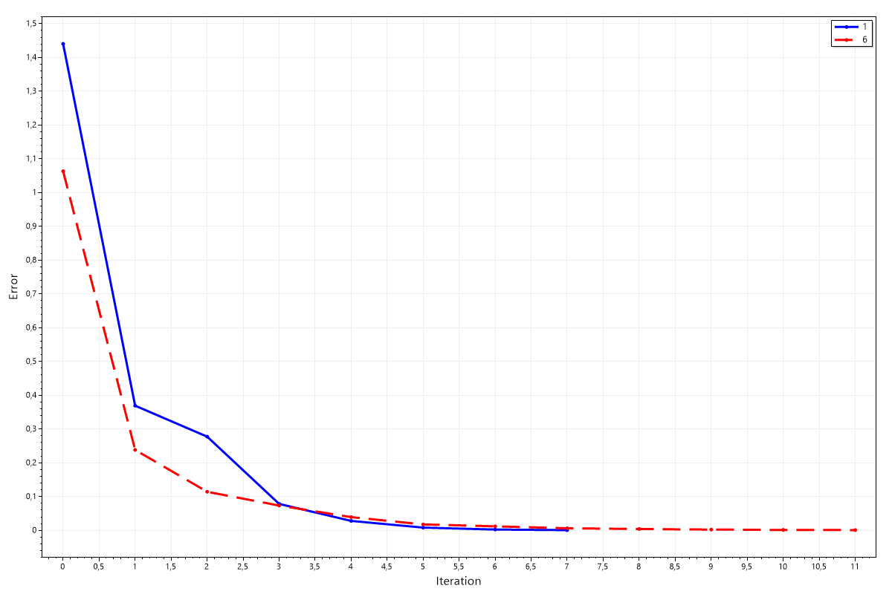
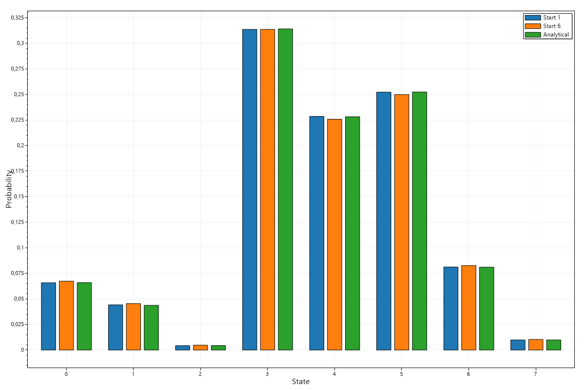

# Отчёт по лабораторной работе №3 "Исследование дискретной цепи маркова"

> Авторы: Шевченко Валерий, Иванов Александр

## Цель работы

Провести аналитическое и численное исследование дискретной цепи Маркова.

## Постановка задачи

Для моделирования была выбрана дискретная эргодическая сеть Маркова, отображающая различные страницы банковского приложения и вероятности перехода пользователя между ними

Матрица переходных вероятностей:

$$
\begin{pmatrix}
0.05 & 0.65 & 0.0 & 0.0 & 0.0 & 0.0 & 0.2 & 0.1 \\
0.1 & 0.01 & 0.1 & 0.79 & 0.0 & 0.0 & 0.0 & 0.0 \\
0.0 & 0.1 & 0.02 & 0.88 & 0.0 & 0.0 & 0.0 & 0.0 \\
0.1 & 0.0 & 0.0 & 0.1 & 0.3 & 0.4 & 0.1 & 0.0 \\
0.0 & 0.0 & 0.0 & 0.3 & 0.2 & 0.5 & 0.0 & 0.0 \\
0.0 & 0.0 & 0.0 & 0.6 & 0.35 & 0.05 & 0.0 & 0.0 \\ 
0.25 & 0.0 & 0.0 & 0.3 & 0.0 & 0.0 & 0.45 & 0.0 \\
0.67 & 0.0 & 0.0 & 0.0 & 0.0 & 0.0 & 0.0 & 0.33 \\
\end{pmatrix}
$$

## Тестирование и сравнение методов решение

В качестве начальных состояний возьмём ситуацию, когда пользователь находится на какой-то из страниц сайта.

Таким образом начальные состояния, используемые для тесты задачи:

Начало в состоянии 1 - $(0, 1, 0, 0, 0, 0, 0, 0)$

Начало в состоянии 6 - $(0, 0, 0, 0, 0, 0, 1, 0)$

Заданная точность - $0.01$, максимальное число итераций - $100$

В результате моделирования получили два конечных вектора:

**Начало в состоянии 1**
- Количество итераций: 8
- Конечный вектор $(0.06582, 0.04419, 0.00434, 0.31374, 0.22852, 0.25226, 0.08125, 0.00987)$

**Начало в состоянии 6**
- Количество итераций: 12
- Конечный вектор $(0.06742, 0.04537, 0.00473, 0.3137, 0.22585, 0,24996, 0.08261, 0.01035)$

График зависимости среднеквадратичного отклонения от итерации

При решении задачи аналитически, получаем следующий результат
- Конечный вектор $(0.06597, 0.04376, 0.00447, 0.31418, 0.22825, 0.25242, 0.08111, 0.00985)$

Итоговое сравнение трёх полученных конечных векторов представлено на следующей гистограмме

Как видно, все три решения схожи между собой